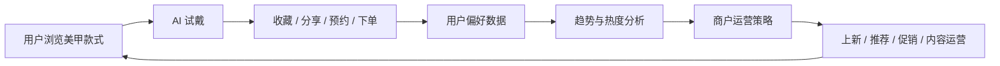

# 美甲 AI 试戴与商户智能运营项目初步设计方案

## 1. 项目定位

本项目面向美甲服务场景，围绕用户决策和商户运营两个核心痛点，建设一套可落地、可预测、可迭代的 AI 系统。

项目目标：

- 让用户能够快速看到美甲款式在自己手上的试戴效果，降低决策成本。
- 让商户能够实时理解款式热度、用户偏好和流行趋势，提升运营效率。
- 通过用户试戴、收藏、预约、下单等行为数据，形成从体验到运营的增长闭环。

项目可以概括为：

> 用 AI 试戴解决用户“看不见效果”的问题，用智能运营解决商户“看不懂趋势”的问题，最终形成从体验、决策到运营增长的完整闭环。

## 2. 当前设计约束

当前阶段可获得的数据主要是：

- 现有手部图片
- 现有美甲图片

因此，设计阶段需要遵守以下原则：

- 不假设已经拥有大量用户行为数据、订单数据、商户经营数据或外部趋势数据。
- 美甲试戴模块优先围绕现有图片完成可运行原型。
- 商户自动化运营策略模块先做“策略框架 + 图片标签 + 人工补充元数据”的原型，不直接依赖真实交易数据。
- 如需编写临时测试样例验证代码可行性，应在验证通过后删除临时测试文件，避免污染项目数据目录。
- 样例数据只在确有必要时少量创建，并优先放在 `data/samples/` 或实验目录中，完成验证后清理。

## 3. 项目模块划分

项目分为两个核心业务模块：

1. 美甲试戴效果生成
2. 商户自动化运营策略

两者之间通过数据闭环连接：

- 试戴模块产生用户偏好与款式意向数据。
- 运营模块基于行为数据、订单数据和外部趋势生成策略。
- 运营策略反向影响款式推荐、上新、促销、内容展示和用户触达。

## 4. 总体系统架构

系统可以拆分为四层：

### 4.1 数据层

主要数据来源包括：

- 用户上传手部图片
- 美甲款式图片
- 款式标签、风格、颜色、甲型、适用场景等人工或半自动补充元数据

后续有条件时可扩展：

- 用户浏览、试戴、收藏、分享、预约、下单等行为数据
- 商户订单、库存、预约和转化率数据
- 平台热榜、社交平台内容趋势、节假日、季节、地域等辅助数据

### 4.2 AI 能力层

主要 AI 能力包括：

- 手部检测
- 指甲区域分割
- 美甲款式贴合与图像融合
- 试戴效果真实感增强
- 用户偏好建模
- 款式热度计算
- 流行趋势分析
- 商户运营策略生成
- 活动文案和内容建议生成

### 4.3 业务服务层

核心服务包括：

- AI 试戴服务
- 款式推荐服务
- 款式热度服务
- 用户画像服务
- 趋势监测服务
- 运营策略生成服务
- 商户数据看板服务
- A/B 测试与效果追踪服务

### 4.4 应用层

应用端包括：

- 用户端：上传手图、选择款式、生成试戴效果、收藏、分享、预约、下单。
- 商户端：查看热款排行、趋势变化、用户偏好、自动运营建议和活动效果。
- 平台端：管理款式、标签、模型、策略、数据质量和整体效果。

## 5. 模块一：美甲试戴效果生成

### 5.1 目标

让用户在浏览美甲款式时，可以快速看到“这款美甲戴在自己手上是什么样”。

### 5.2 核心流程

1. 用户上传或拍摄手部图片。
2. 系统识别手部位置和指甲区域。
3. 用户选择美甲款式。
4. AI 将款式贴合到用户指甲区域。
5. 输出自然、真实、可比较的试戴效果图。
6. 用户进行收藏、分享、预约或下单。

### 5.3 关键能力

#### 手部检测与指甲分割

识别手部位置、手指方向、每个指甲区域，并输出可用于图像贴合的 mask。

可选技术：

- OpenCV
- MediaPipe Hands
- Segment Anything
- U-Net
- Mask R-CNN

#### 指甲形态适配

不同用户的指甲长度、宽度、甲型和拍摄角度不同，系统需要对款式图案进行缩放、旋转、透视变换和边缘适配。

#### 美甲款式迁移

初期优先支持：

- 纯色款
- 渐变款
- 法式款
- 猫眼款
- 亮片款
- 简单图案款

后续扩展：

- 贴钻款
- 手绘款
- 复杂纹理款
- 文本生成款式

#### 真实感增强

包括：

- 光照匹配
- 边缘融合
- 指甲高光保留
- 肤色与材质协调
- 透明度和光泽感调整

### 5.4 MVP 方案

MVP 阶段优先采用“模板贴合 + 图像融合”的可控方案。

输入：

- 用户手部图片
- 美甲款式图或款式颜色/纹理

处理：

- 检测手部
- 分割指甲区域
- 将款式图案变形贴合到指甲区域
- 做边缘融合和颜色修正

输出：

- 用户试戴效果图
- 每个指甲区域 mask
- 款式和用户行为记录

### 5.5 后续增强方向

- 使用扩散模型增强真实感。
- 支持文字生成款式。
- 根据肤色、手型、季节和场景推荐款式。
- 支持多款并排对比。
- 支持短视频或实时摄像头试戴。

## 6. 模块二：商户自动化运营策略

### 6.1 目标

帮助商户从“凭经验运营”升级为“数据驱动运营”，解决选款、上新、促销、内容发布和用户触达中的判断问题。

当前阶段由于只有手部图片和美甲图片，商户运营模块先做“可解释的策略原型”，重点是建立款式标签体系、基础分类规则和策略生成框架。

### 6.2 核心流程

1. 整理现有美甲图片。
2. 为美甲图片补充颜色、风格、甲型、复杂度、适用场景等标签。
3. 基于标签生成款式分类、推荐理由和运营建议。
4. 形成可解释的策略卡片，例如主推款、日常款、节日款、低门槛款、高客单款等。
5. 后续接入真实行为数据后，再扩展热度预测和效果追踪。

### 6.3 热度指标设计

当前阶段如无真实行为数据，可先使用“标签优先级 + 人工评分”的方式构建基础款式评分。

初步图片侧评分：

```text
款式基础分 =
风格清晰度 * 0.25 +
视觉吸引力 * 0.25 +
适用场景数量 * 0.20 +
制作复杂度匹配度 * 0.15 +
季节/节日适配度 * 0.15
```

接入行为数据后，可升级为：

```text
款式热度分 =
浏览量 * 0.15 +
试戴量 * 0.25 +
收藏量 * 0.20 +
分享量 * 0.10 +
预约量 * 0.15 +
下单量 * 0.15 +
外部趋势分 * 0.10
```

后续可以根据实际数据调整权重，或者用机器学习模型自动学习权重。

### 6.4 款式状态分类

当前阶段可以先将款式分为：

- 主推款：视觉效果强，适合放在首页或推荐位。
- 日常款：颜色低调，适合通勤、学生和日常场景。
- 节日款：适合情人节、七夕、新年、婚礼等节点。
- 高客单款：复杂度高，适合套餐或高价服务。
- 引流款：制作门槛低，适合优惠活动和新客转化。

接入行为数据后，再扩展为：

- 爆款：当前热度高，转化也高。
- 增长款：热度快速上升，值得加大曝光。
- 潜力款：试戴、收藏高，但下单还未充分释放。
- 下滑款：历史表现好，但近期热度下降。
- 滞销款：曝光和转化都低，需要降权、组合促销或下架。

### 6.5 趋势分析维度

主要分析维度：

- 颜色趋势：裸粉、奶茶色、酒红、蓝色、绿色等。
- 风格趋势：韩系、通勤、甜酷、辣妹、法式、千金风等。
- 场景趋势：日常、约会、婚礼、节日、旅行、职场等。
- 季节趋势：春夏清透、秋冬深色、节假日限定。
- 人群趋势：学生、白领、新娘、年轻宝妈等。
- 地域趋势：不同城市和商圈的偏好差异。

### 6.6 自动运营策略类型

系统可以生成以下策略：

- 本周主推款式建议
- 新款上架建议
- 高浏览低下单款优化建议
- 高试戴高收藏款促销建议
- 下滑款清仓或组合套餐建议
- 节假日专题活动建议
- 用户分群推荐策略
- 商户内容发布文案
- 平台搜索和推荐位调整建议

### 6.7 策略效果评估

当前阶段先评估策略完整性和可解释性：

- 是否能覆盖不同风格款式。
- 是否能给出明确主推理由。
- 是否能生成可执行的活动建议。
- 是否能解释适用人群和适用场景。

接入真实业务数据后，再评估：

- 曝光量
- 点击率
- 试戴率
- 收藏率
- 预约率
- 下单转化率
- 客单价
- 复购率
- 活动 ROI

## 7. 数据闭环

完整闭环如下：



核心价值：

- 试戴次数体现用户兴趣。
- 试戴后收藏体现强偏好。
- 试戴后预约或下单体现真实转化。
- 高试戴低下单可以暴露价格、款式落地或服务转化问题。
- 商户可以根据数据调整选款、活动和内容。

## 8. 推荐技术架构

### 8.1 前端

可选方案：

- 小程序
- React
- Vue

用户端重点：

- 上传图片
- 款式选择
- 试戴效果展示
- 多款对比
- 收藏、预约、下单入口

商户端重点：

- 数据看板
- 热款排行
- 趋势曲线
- 策略卡片
- 活动文案生成

### 8.2 后端

可选方案：

- Python FastAPI
- Java Spring Boot

核心职责：

- 用户、商户和款式管理
- 图片上传与任务管理
- 行为埋点接收
- 策略生成接口
- 数据看板接口

### 8.3 AI 服务

建议独立部署为 Python 服务。

核心职责：

- 手部检测
- 指甲分割
- 款式贴合
- 图像融合
- 趋势分析
- 策略生成

### 8.4 数据存储

建议：

- MySQL 或 PostgreSQL：业务数据。
- Redis：缓存、任务状态、热点数据。
- 对象存储：用户图片、款式图、试戴结果图。
- 本地数据文件：MVP 阶段可先用 CSV、Excel 或 JSON。

### 8.5 可视化

建议：

- ECharts
- AntV
- Recharts

## 9. MVP 范围

### 9.1 用户端 MVP

- 上传手部图片。
- 选择美甲款式。
- 生成试戴效果图。
- 保存试戴记录。
- 收藏款式。
- 进入预约入口。

### 9.2 商户端 MVP

- 款式图片管理。
- 款式标签管理。
- 款式分类看板。
- 主推款、日常款、节日款、高客单款、引流款分类。
- 基于标签生成运营建议。
- 一键生成活动文案。

后续接入行为数据后再扩展：

- 试戴次数排行。
- 收藏排行。
- 下单转化排行。
- 热度趋势曲线。

### 9.3 后台 MVP

- 款式管理。
- 标签管理。
- 图片管理。
- 基础评分计算。
- 策略生成。
- 临时实验文件清理规范。

## 10. 项目阶段规划

### 第一阶段：项目基础与数据理解

目标：

- 梳理数据字段。
- 明确核心业务流程。
- 建立目录结构和文档体系。
- 定义 MVP 边界。

产出：

- 项目规划文档。
- 数据字段说明。
- 功能模块说明。
- 第一版原型流程。

### 第二阶段：AI 试戴原型

目标：

- 完成手部图片上传。
- 完成基础指甲区域识别。
- 完成模板式美甲贴合。
- 输出可展示的试戴效果图。

产出：

- AI 试戴 demo。
- 试戴效果样例。
- 试戴效果评估指标。

### 第三阶段：行为数据与热度分析

目标：

- 设计用户行为埋点。
- 建立款式热度计算逻辑。
- 形成热款、增长款、潜力款、下滑款分类。

产出：

- 行为数据模型。
- 款式热度模型。
- 商户看板基础接口。

### 第四阶段：商户运营策略生成

目标：

- 基于热度、趋势和转化数据生成运营建议。
- 支持活动文案生成。
- 支持不同款式状态的策略解释。

产出：

- 策略生成规则。
- 策略生成接口。
- 商户运营建议样例。

### 第五阶段：产品化与评估

目标：

- 完善用户端和商户端体验。
- 做 A/B 测试和效果追踪。
- 根据转化数据优化策略。

产出：

- 完整 MVP。
- 效果评估报告。
- 后续迭代计划。

## 11. 当前目录规划

```text
meituan/
├── PROJECT_PLAN.md
├── docs/
│   └── 用于存放需求、流程、数据字典、接口设计等文档
├── modules/
│   ├── nail-tryon/
│   │   └── 美甲试戴效果生成模块
│   └── merchant-ops/
│       └── 商户自动化运营策略模块
├── data/
│   └── 用于存放原始数据、清洗后数据、样例数据和数据说明
├── ai-services/
│   └── 用于存放图像处理、模型推理和策略生成相关服务
├── backend/
│   └── 用于存放后端接口服务
├── frontend/
│   └── 用于存放用户端和商户端前端应用
├── experiments/
│   └── 用于存放试验脚本、模型评估和方案验证
└── reports/
    └── 用于存放阶段性总结、评估报告和展示材料
```

## 12. 下一步建议

优先从以下三件事开始：

1. 盘点现有手部图片和美甲图片，明确图片数量、格式、命名和质量。
2. 为“美甲试戴效果生成”写第一版功能需求文档。
3. 为“商户自动化运营策略”写第一版标签体系和策略规则文档。

建议下一步先处理现有图片资产，因为图片结构会直接影响试戴原型、标签体系和后续运营策略设计。
