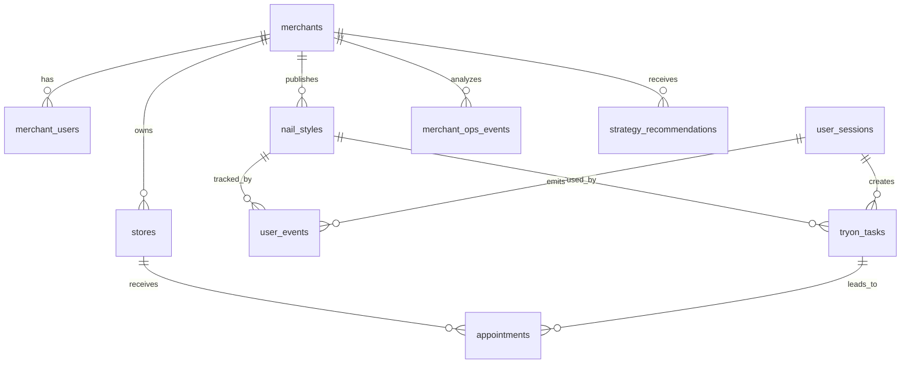

# MySQL 数据库存储设计草案

本文记录后续将商家账号、用户行为、试戴任务和运营分析数据迁移到 MySQL 时建议建立的核心表，以及表与表之间的逻辑关系。

当前项目仍使用本地 JSONL：

- 用户端行为：`backend/data/click_events.jsonl`
- 商家运营样本：`backend/data/merchant_ops_test_records.jsonl`

后续接 MySQL 时，可以先保留现有接口形态，把底层 repository 从 JSONL 替换为数据库读写。

## 业务对象关系

整体关系可以理解为：

简化说明：

- 一个商家 `merchants` 可以有多个登录账号 `merchant_users`。
- 一个商家可以有多个门店 `stores`。
- 一个商家可以发布多个美甲款式 `nail_styles`。
- 用户在用户端产生的点击、筛选、收藏、预约意向等行为进入 `user_events`。
- 用户每次 AI 试戴生成一条 `tryon_tasks`，可关联手图、款式、生成结果和任务状态。
- 如果用户提交预约意向，进入 `appointments`，并关联商家、门店、款式、试戴任务。
- 商家端数据分析可以基于 `user_events`、`tryon_tasks`、`appointments` 聚合生成。
- 运营策略助手生成的建议存入 `strategy_recommendations`，方便追踪采纳和效果。

## 核心表

### 1. `merchants` 商家表

用途：存储商家主体信息，是商家端数据隔离的核心维度。

关键字段：

- `id`：主键。
- `merchant_id`：业务唯一 ID，例如 `merchant_001`。
- `name`：商家名称。
- `status`：状态，建议 `active`、`paused`、`disabled`。
- `contact_name`：联系人。
- `contact_phone`：联系电话。
- `created_at`、`updated_at`。

关系：

- 被 `merchant_users`、`stores`、`nail_styles`、`appointments`、`strategy_recommendations` 引用。

### 2. `merchant_users` 商家登录账号表

用途：存储商家后台登录账号。

关键字段：

- `id`：主键。
- `merchant_id`：外键，关联 `merchants.merchant_id`。
- `username`：登录用户名，唯一。
- `password_hash`：密码哈希，不能存明文。
- `role`：角色，例如 `owner`、`operator`、`viewer`。
- `status`：账号状态。
- `last_login_at`：最近登录时间。
- `created_at`、`updated_at`。

关系：

- 多个账号可以属于同一个商家。
- 登录成功后用 `merchant_id` 控制商家端只能看自己的数据。

### 3. `stores` 门店表

用途：存储商家门店信息，用于预约和门店维度分析。

关键字段：

- `id`：主键。
- `store_id`：业务唯一 ID。
- `merchant_id`：外键。
- `name`：门店名称。
- `city`、`address`。
- `status`。
- `created_at`、`updated_at`。

关系：

- 一个商家可以有多个门店。
- 预约表 `appointments` 关联门店。

### 4. `nail_styles` 美甲款式表

用途：存储可试戴款式、标签、价格和素材路径。

关键字段：

- `id`：主键。
- `style_id`：业务唯一 ID，例如 `style_001`。
- `merchant_id`：外键。平台公共款可用特殊商家 ID 或增加 `owner_type`。
- `title`：款式名称。
- `price`：价格，建议用分为单位的整数 `price_cents`。
- `duration_minutes`：服务时长。
- `status`：上架状态。
- `preview_image_path`：预览图路径。
- `original_image_path`：原始素材路径。
- `tags_json`：标签 JSON，例如 `["法式", "显白"]`。
- `created_at`、`updated_at`。

关系：

- 被 `user_events`、`tryon_tasks`、`appointments` 引用。
- 商家端款式表现主要按 `style_id` 聚合。

### 5. `user_sessions` 用户会话表

用途：记录匿名用户会话，不强制要求用户登录。

关键字段：

- `id`：主键。
- `session_id`：前端生成的会话 ID。
- `first_seen_at`、`last_seen_at`。
- `client_ip_hash`：可选，建议哈希后保存。
- `user_agent`：可选。

关系：

- 一个会话会产生多个 `user_events` 和 `tryon_tasks`。

### 6. `user_events` 用户行为事件表

用途：替代当前 `click_events.jsonl`，记录用户端点击、筛选、收藏、对比、预约意向等事件。

关键字段：

- `id`：主键。
- `event_id`：事件唯一 ID，可由后端生成。
- `session_id`：关联 `user_sessions.session_id`。
- `merchant_id`：可空，能归属商家时写入。
- `style_id`：可空，关联款式。
- `event_type`：事件类型，例如 `style_click`、`hand_upload`、`local_preview_generated`、`ai_tryon_completed`、`style_favorite`、`appointment_intent`。
- `page`：页面标识。
- `detail_json`：事件详情 JSON。
- `occurred_at`：前端发生时间。
- `received_at`：后端接收时间。

关系：

- 商家端点击量、试戴量、收藏量、候选款对比等指标主要从这张表聚合。
- 与 `nail_styles` 通过 `style_id` 关联。

### 7. `tryon_tasks` AI 试戴任务表

用途：记录每一次试戴生成任务。

关键字段：

- `id`：主键。
- `task_id`：业务任务 ID。
- `session_id`：用户会话 ID。
- `merchant_id`：可空。
- `style_id`：款式 ID。
- `hand_image_path`：用户手图存储路径。
- `result_image_path`：生成结果图路径。
- `mode`：`ai` 或 `local_preview`。
- `strategy`：例如 `high_precision_crop`、`full_image_fast`。
- `status`：`pending`、`success`、`failed`。
- `error_code`、`error_message`。
- `created_at`、`completed_at`。

关系：

- 用户端历史记录、商家端试戴量、AI 成功率都可以来自这张表。
- 如果后续预约来自某张试戴结果，`appointments.tryon_task_id` 可关联它。

### 8. `appointments` 预约意向表

用途：存储用户提交的预约意向。

关键字段：

- `id`：主键。
- `appointment_id`：业务唯一 ID。
- `merchant_id`：外键。
- `store_id`：外键。
- `style_id`：款式 ID。
- `tryon_task_id`：可空，关联试戴任务。
- `session_id`：用户会话 ID。
- `phone_hash`：手机号哈希。
- `phone_masked`：脱敏手机号，例如 `138****1234`。
- `preferred_time`：用户选择时间。
- `status`：`submitted`、`confirmed`、`cancelled`、`completed`。
- `created_at`、`updated_at`。

关系：

- 商家端转化量、预约率、门店维度分析来自这张表。
- 注意手机号属于敏感信息，建议只保存哈希和脱敏展示值。

### 9. `merchant_ops_events` 商家运营样本表

用途：替代当前 `merchant_ops_test_records.jsonl`，记录商家运营分析需要的聚合或样本事件。

关键字段：

- `id`：主键。
- `merchant_id`：外键。
- `style_id`：可空。
- `event_type`：例如 `campaign_candidate`、`featured_style_set`、`campaign_generated`。
- `style_tags_json`：款式标签。
- `scenario_tags_json`：场景标签。
- `metrics_json`：点击、试戴、收藏、转化等指标快照。
- `notes`：备注。
- `created_at`。

关系：

- 可以作为策略助手、活动方案生成和运营复盘的输入。
- 如果基础事件量够大，也可以减少这张表，直接从 `user_events` 聚合。

### 10. `strategy_recommendations` 策略建议表

用途：保存 AI/规则策略助手输出，方便商家查看、采纳、追踪效果。

关键字段：

- `id`：主键。
- `recommendation_id`：业务唯一 ID。
- `merchant_id`：外键。
- `style_id`：可空。
- `title`。
- `action_type`：例如 `set_featured_style`、`promote_tag`、`collect_more_events`。
- `confidence`：`high`、`medium`、`low`。
- `reason_json`：推荐理由。
- `risk_json`：风险提示。
- `payload_json`：完整策略 JSON。
- `status`：`new`、`accepted`、`rejected`、`expired`。
- `created_at`、`accepted_at`。

关系：

- 与 `merchants` 关联。
- 可选关联 `nail_styles`。
- 后续可以把采纳后的结果与 `user_events`、`appointments` 做效果归因。

## 推荐索引

为了支撑商家工作台查询，建议至少建立：

- `merchant_users.username` 唯一索引。
- `merchants.merchant_id` 唯一索引。
- `stores.store_id` 唯一索引。
- `nail_styles.style_id` 唯一索引。
- `user_sessions.session_id` 唯一索引。
- `user_events(event_type, received_at)`。
- `user_events(merchant_id, received_at)`。
- `user_events(style_id, received_at)`。
- `tryon_tasks(merchant_id, created_at)`。
- `tryon_tasks(style_id, created_at)`。
- `appointments(merchant_id, created_at)`。
- `appointments(store_id, created_at)`。
- `strategy_recommendations(merchant_id, created_at)`。

## 数据流

### 商家登录

1. 商家输入用户名和密码。
2. 后端根据 `merchant_users.username` 查询账号。
3. 校验 `password_hash`。
4. 登录成功后生成 session 或 JWT。
5. 后续请求携带登录态，后端根据账号映射到 `merchant_id`。
6. 商家端所有数据查询都必须带上当前登录账号的 `merchant_id`，不能由前端随便传一个商家 ID 决定权限。

### 用户点击与试戴数据

1. 用户端触发行为，例如选款、收藏、预约。
2. 前端上报到 `/api/events`。
3. 后端写入 `user_events`。
4. 如果是 AI 试戴任务，同时写入或更新 `tryon_tasks`。
5. 如果是预约意向，同时写入 `appointments`。
6. 商家端从这些表聚合点击量、试戴量、收藏率、预约转化率和趋势图。

### 商家运营分析

1. 工作台请求当前商家的 dashboard。
2. 后端基于 `merchant_id` 查询 `user_events`、`tryon_tasks`、`appointments`。
3. 聚合出款式表现、标签热度、每日趋势和转化漏斗。
4. 策略助手生成建议后写入 `strategy_recommendations`。

## 最小落地顺序

建议不要一上来建太多表。最小可用版本可以按这个顺序做：

1. `merchants`
2. `merchant_users`
3. `nail_styles`
4. `user_sessions`
5. `user_events`
6. `tryon_tasks`
7. `appointments`
8. `strategy_recommendations`

`stores` 和 `merchant_ops_events` 可以在需要门店维度、运营样本沉淀时再补。

## 安全注意事项

- 密码必须哈希保存，建议 `bcrypt` 或 `argon2`。
- 手机号不要明文展示，保存哈希和脱敏值。
- 商家端接口必须由后端根据登录态决定 `merchant_id`，不要信任前端传入的商家 ID。
- 平台趋势必须聚合脱敏，不能把其他商家的原始数据暴露给当前商家。
